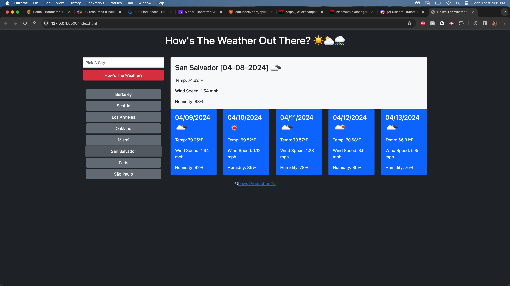
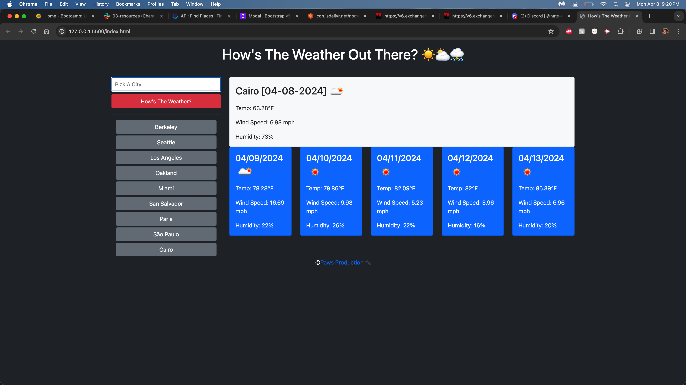

# weather-ball
Checking weather all over the world
## Description

Using two API links from openweathermap.org, we were tasked with building a weather dashboard. This dashboard would save searches for the user to return to, and give the day's weather + a five day forecast. It's a nifty little app that's used by many, but actually building it was a beast, especially given the difficulties of the week. Bugs and things were chalked up to missing parentheses, uncalled functions, mismatched IDs. It was a lot of reiterating on console logging to debug amd combing through lines to find even the smallest error.

## Installation

The link works in a browser, as with the previous module challenges.

## Usage

When the page loads, all that is needed is the name of the city you're looking for. Up to twenty will be saved to the left of the page, with the ability to go back into that city's weather information when those buttons are clicked.

    ```md
    
    ```
     ```md
    
    ```

## Credits

The speedrun once again came in clutch, as did the help from my support system helping me find those last minute tiny bugs. https://zoom.us/rec/play/WsRG3k8Zb3HQGTCvPOOe-bziH1MVikpFDj3YOq05PDPhft6a8K4RM0sjtPPpmW5Eg11EROhlniieSrBy.0-RN7FXQG7PNpPnU?canPlayFromShare=true&from=share_recording_detail&continueMode=true&componentName=rec-play&originRequestUrl=https%3A%2F%2Fzoom.us%2Frec%2Fshare%2F4dK5i4ZS-uXlce95QM_AWVOl_NfG4u-nwiM46yXsEafJeVUib_QLCTqXNoDweGpc.5acO9DK2I61oTkgu

## License

The standard MIT license was used for this module.